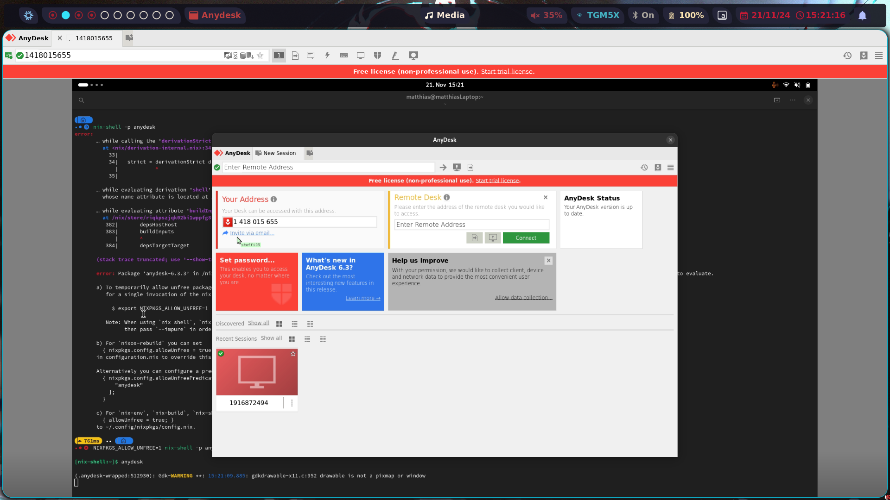
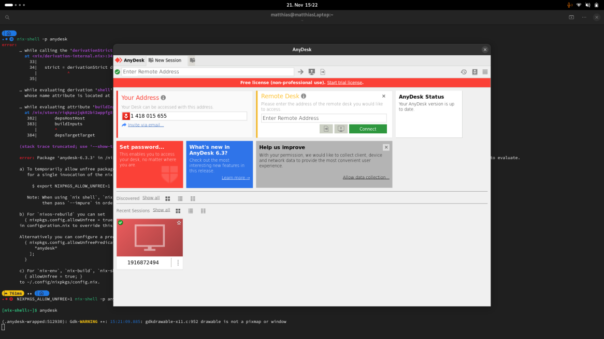
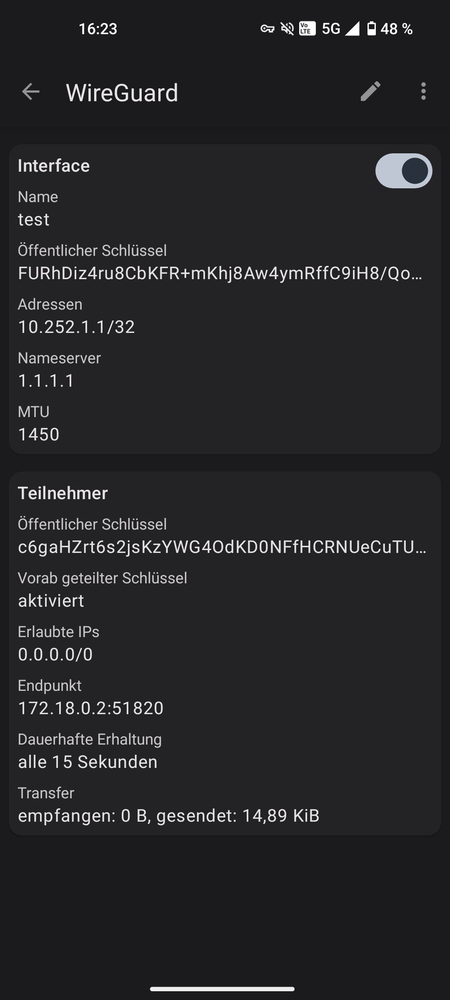

# Fernwartung "Anwendung und Kryptographie"
## SSH

### Server
#### Setup
```bash
$ apt update
$ apt install openssh-server

$ nano /etc/ssh/sshd_conf
#/etc/ssh/sshd_conf

PermitRootLogin no
AllowTCPForwarding yes
GatewayPorts yes
ListenAddress 127.0.0.1

# As root
$ ssh-keygen -t rsa -b 4096


$ ssh-copy-id -i /root/.ssh/id_rsa.pub <user>@<client_ip>
```
#### Autostart ssh-tunel
```bash
$ sudo nano /etc/systemd/system/ssh-tunel.service
# /etc/systemd/system/ssh-tunel.service

[Unit]
Description=SSH-Tunnel
After=network.target
Requires=network-online.target

[Service]
Type=simple
ExecStart= /usr/bin/ssh -i /root/.ssh/id_rsa -N -R 222:localhost:22 <user>@<client_ip>
Restart=always
RestartSec=5

[Install]
WantedBy=multi-user.target

$ systemctl daemon-reload
$ systemctl enable ssh-tunel.service
$ systemctl start ssh-tunel.service
```

## Client
```bash
$ apt update
$ apt install openssh-server

$ nano /etc/ssh/sshd_conf
#/etc/ssh/sshd_conf

PermitRootLogin no
AllowTCPForwarding yes
GatewayPorts no

# As normal user
$ ssh-keygen -t rsa -b 4096

$ ssh -p 2222 localhost
```

## Webaccessed Desktop Environment

Requirements:
* docker
* docker-compose

```bash
$ cd webtop
$ sh ./docker-compose-helper.sh build # To build the docker image
$ sh ./docker-compose-helper.sh start # To start the docker container
$ sh ./docker-compose-helper.sh stop # To stop the docker container
```

## RDP
Mittels anydesk (Nur Xorg)

### Installation NixOS
```bash
$ nix-shell -p anydesk
$ anydesk
```

#### Client


#### Remote Host


## Wireguard
Requirements:
* docker
* docker-compose

### Set Up

```bash
$ cd wireguard
$ docker-compose up -d
```

### Wireguard Server
```
# Post Up Script
iptables -A FORWARD -i %1 -j ACCEPT; iptables -A FORWARD -o wg0 -j ACCEPT; iptables -t nat -A POSTROUTING -o eth+ -j MASQUERADE

# Post Down Script
iptables -D FORWARD -i %1 -j ACCEPT; iptables -D FORWARD -o wg0 -j ACCEPT; iptables -t nat -D POSTROUTING -o eth+ -j MASQUERADE
```

### Global Settings
Use suggested IP as Endpoint Address

### Create new Client
IP Allocation: `10.252.1.1/32`



## Fragestellungen

### Vor- und Nachteile der Verwendung von Passwörtern im Key-Authentication-Verfahren
Vorteile:
* Kein physisches Medium erforderlich: Nur das Passwort muss bekannt sein, kein zusätzlicher Key oder Gerät.
* Einfach in der Handhabung: Benutzer müssen sich nur ein Passwort merken.

Nachteile:
* Schwächere Sicherheit: Passwörter sind anfälliger für Brute-Force- oder Wörterbuchangriffe im Vergleich zu SSH-Keys.
* Keine asymmetrische Verschlüsselung: Passwörter können abgefangen werden, während SSH-Keys asymmetrisch arbeiten und sicherer sind.
* Abhängigkeit von menschlicher Erinnerung: Schwache oder wiederverwendete Passwörter erhöhen das Risiko von Sicherheitsverletzungen.

### Einsatz verschiedener Keys bei verschiedenen SSH-Connections
Um verschiedene SSH-Keys zu verwenden, kann man in der ~/.ssh/config Datei pro Host spezifische Einstellungen definieren. Beispiel:
```
Host server1
  HostName server1.example.com
  User user1
  IdentityFile ~/.ssh/id_rsa_server1

Host server2
  HostName server2.example.com
  User user2
  IdentityFile ~/.ssh/id_rsa_server2
```

### Was ist VNC und wie kommt es zum Einsatz?
* Definition: Virtual Network Computing (VNC) ist ein Remote-Desktop-Protokoll, das die Anzeige und Steuerung einer entfernten Desktop-Oberfläche ermöglicht.

Einsatzbereiche:
* Zugriff auf grafische Benutzeroberflächen von Servern, die keinen Monitor haben.
* Fernwartung und Support.
* Arbeiten auf entfernten Maschinen mit vollem Desktop-Zugriff.

* Funktionsweise: VNC überträgt die Bildschirmdaten als Bilddaten (Pixel), was es flexibel, aber potenziell langsam bei schlechten Verbindungen macht. Es erfordert einen VNC-Server auf dem Zielsystem und einen VNC-Client auf dem zugreifenden Gerät.

### Mit einem Browser eine Desktop-Umgebung einsetzen
Lösungsansatz: Tools wie noVNC oder Apache Guacamole können verwendet werden.
* noVNC: Ermöglicht den Zugriff auf VNC-Sitzungen direkt über einen Webbrowser, indem VNC-Bildschirmdaten in WebSocket-Daten übersetzt werden.
* Apache Guacamole: Plattform für Remote-Desktop-Zugriff über den Browser, unterstützt Protokolle wie RDP, VNC und SSH.

Ein Browser sendet hierbei keine nativen RDP- oder VNC-Pakete, sondern kommuniziert mit einem Webserver, der die Protokolle bereitstellt.

### Kryptographie-Protokolle bei WireGuard und deren Beschreibung
WireGuard verwendet moderne, minimalistische Kryptographie:

* ChaCha20: Für symmetrische Verschlüsselung.
* Poly1305: Für Authentifizierung.
* Curve25519: Für Schlüsselaustausch.
* BLAKE2s: Für Hashing.
* HKDF: Für Schlüsselableitung.

Diese werden in der offiziellen WireGuard Whitepaper-Dokumentation beschrieben und detailliert erläutert.

### Ansatz von WireGuard bei unauthentifizierten Paketen: Silence is a Virtue
Ansatz: WireGuard ignoriert unauthentifizierte oder fehlerhafte Pakete anstatt darauf zu antworten.
Begründung:

* Verhindert, dass Angreifer Rückschlüsse auf aktive Hosts oder Verbindungen ziehen können.
* Reduziert die Angriffsfläche für Denial-of-Service-Attacken (keine Ressourcenverschwendung für ungültige Anfragen).

Dieser Ansatz wird in der Sicherheitsphilosophie von WireGuard als „Silent Drop“ bezeichnet.
